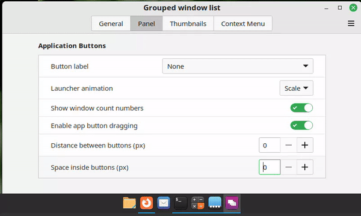

# linux-cinnamon-grouped-window-list-fork
Adds extra options to the grouped window list plugin for the Cinnamon desktop enviroment

- Currently I have added the option to change the spacing between the application icons
- Also looking to add:
  - Change the padding (icon size) (while retaining the indicator and overall size of the button)
  - Change the position of the indicator (top, left, right, bottom)
- Don't run the installer/uninstaller with sudo! You will be prompted for a password after you run the script.

